# 素质类项目成绩管理系统

##### 小组成员：林星、詹梓航、高霁泉、鞠赫铭

素质类项目成绩管理系统，用于管理至少30名学生的素质类项目信息。

项目信息以带头单向不循环链表作为数据结构，支持增删查改，其中：
- 每名学生的信息包括学生的学号姓名及性别、成绩信息、论文信息、项目信息、获奖信息几个部分。
- 每条成绩信息包括：科目名称、分数。
- 每条论文信息包括：论文题目、作者及通讯作者、期刊、页码/论文编号、发表日期、论文级别。
- 每条项目信息包括：项目名称、成员及指导老师、项目编号、开始及结束日期。
- 每条获奖信息包括：奖项名称、颁奖机构、获奖成员、获奖级别、获奖日期。
- 需要有完善美观的图形化界面、合乎逻辑的操作方式与合理的数据保存与读取机制。

为简化结构，做如下规定：
- 如果涉及时间，仅包括年月日。
- 每名学生至多有5篇论文、5个项目、5次获奖。其中每篇论文/每个项目/每次获奖的作者/成员至多10位（其中包括通讯作者/指导老师）。
- 论文级别分为：T特种刊物论文、A权威核心刊物论文、B重要核心刊物论文、C一般核心刊物论文、D一般公开刊物论文、E受限公开刊物论文。
- 若涉及姓名，至多占据20字节；性别至多占据10字节；论文标题/项目名称/获奖名称至多占据50字节；期刊名至多占据50字节；页码/卷期/论文编号至多占据10字节；颁奖机构名至多占据50字节；获奖级别至多占据10字节。
- 所有整形数值不超过**INT_MAX**，浮点值仅显示前两位小数点。

具体功能要求如下：
- 打开程序时展开登录界面（模态Dialog），用户名或密码留空、用户名或密码错误则弹出对应警告提示窗（密码使用md5加密并与用户名一同存储在login.ini中）。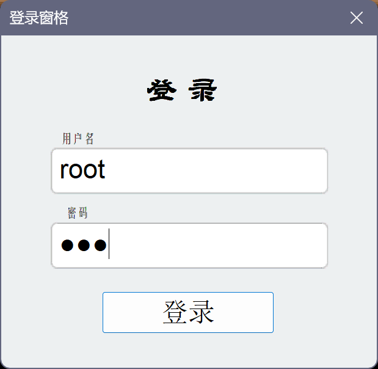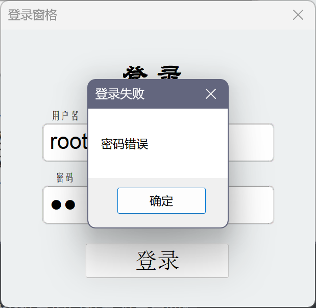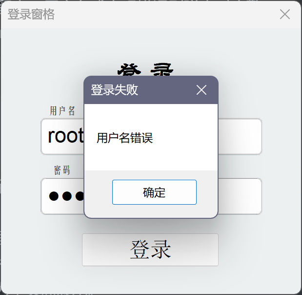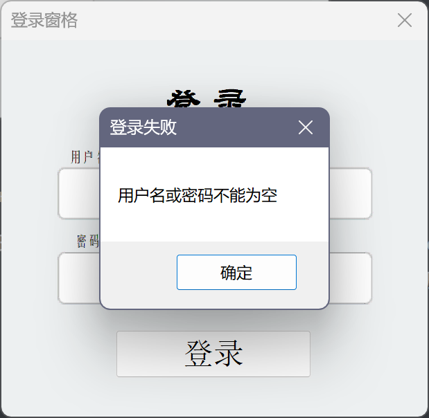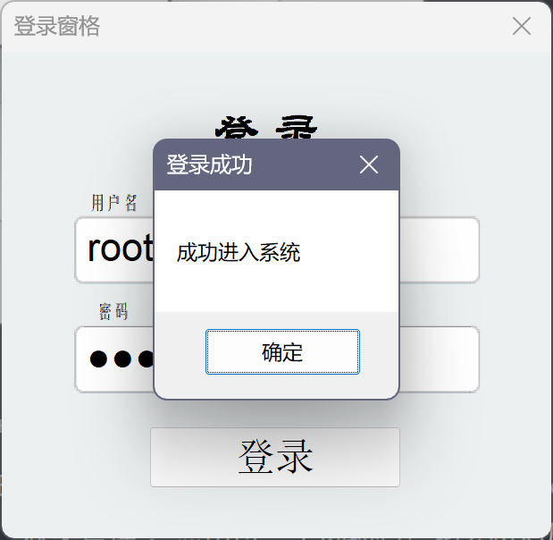

  

- 用户名密码正确则展示程序主体界面，主题界面通过静态拆分窗口拆分为左右两栏。

- 左栏为导航栏，包括“个人信息”、“学生管理”、“成绩管理”、“素质类项”共四项选项（通过TreeControl实现）。其中素质类项展开三个子项，分别为“论文管理”、“项目管理”、“获奖管理”。点击每一个选项右栏均会将对应的Child类型Dialog作为子页面展示。

  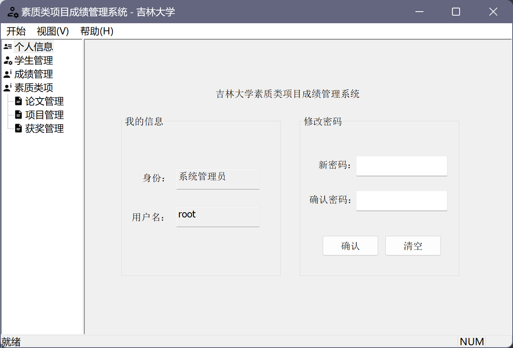

- 对于个人信息界面，存在两个GroupBox。左侧为个人信息显示，用两个EditControl显示身份和用户名（只读），右侧为修改密码界面，需要在两个EditControl中输入相同的密码并点击确认Button来修改密码（md5加密后存储在login.ini中）。同时对于各种非法输入存在MessageBox的提醒。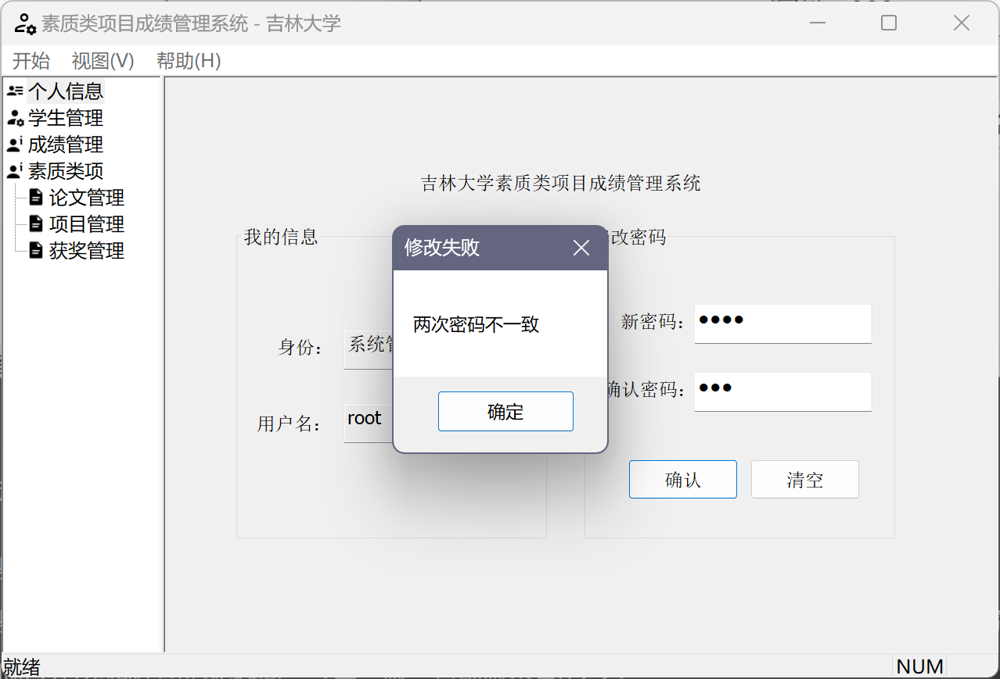

- 对于学生管理界面，通过TabControl和引入CTabSheet类实现多标签页，存在两个标签页，分别为“显示学生列表”和“查找学生信息”。

  - 对于显示学生列表标签页，存在一个ListControl和两个GroupBox，在ListControl中罗列学生信息（排序）。选中ListControl中对应行后可在右侧GroupBox中对该学生做出对应的修改。

    

    + 若点击“添加新学生”按钮，将弹出模态Dialog用于添加学生。

      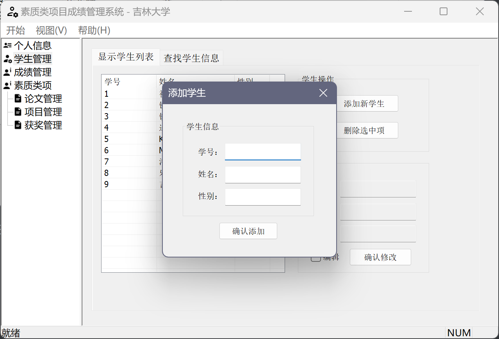

    + 若点击“编辑”CheckBox（复选框）将锁定其他操作并将GroupBox中上面相关的EditControl从只读设置为可编辑。

      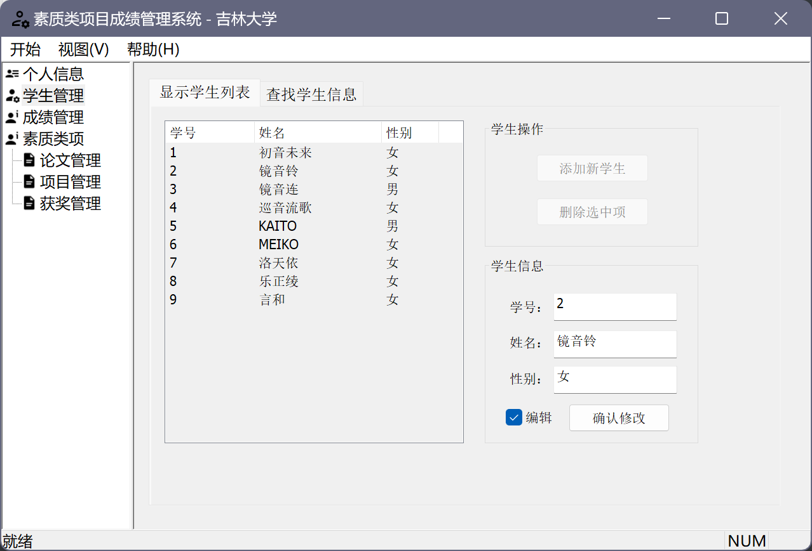

  - 对于查找学生标签页，同样存在一个ListControl和两个GroupBox，基本操作相同，查找方式可选按学号或按姓名，支持模糊搜索（仅限按姓名时）。

    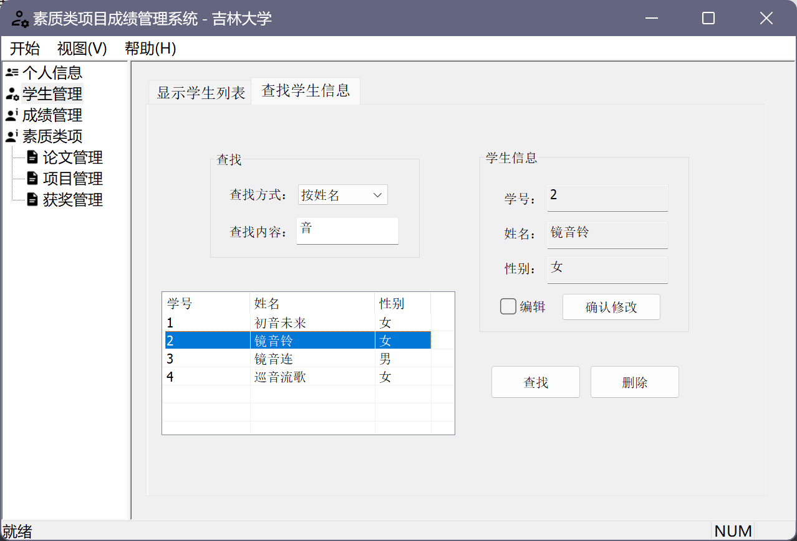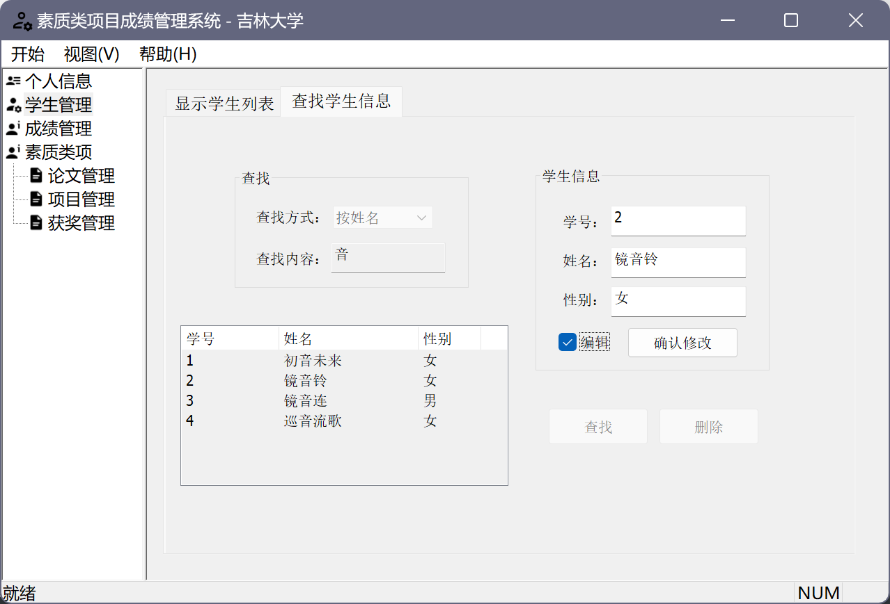

- 对于成绩管理界面，存在两个GroupBox和一个LicstControl，大体操作思路与其他标签页类似不再赘述。

  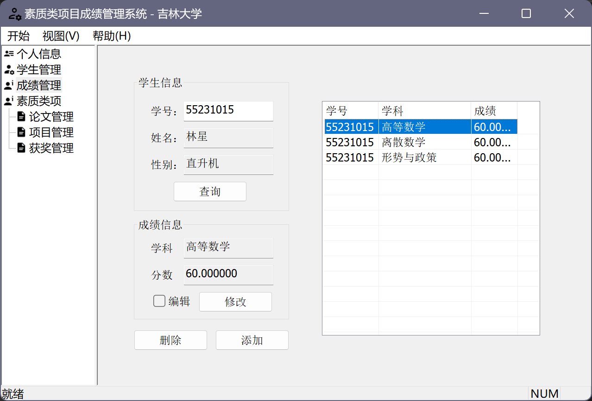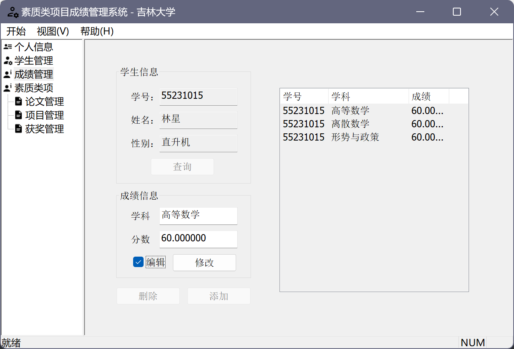
  
  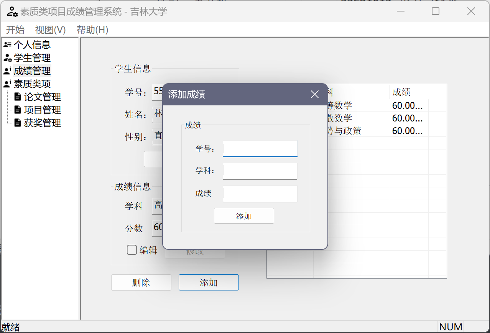
  
- 对于素质类项界面，展示提示文字。
  
  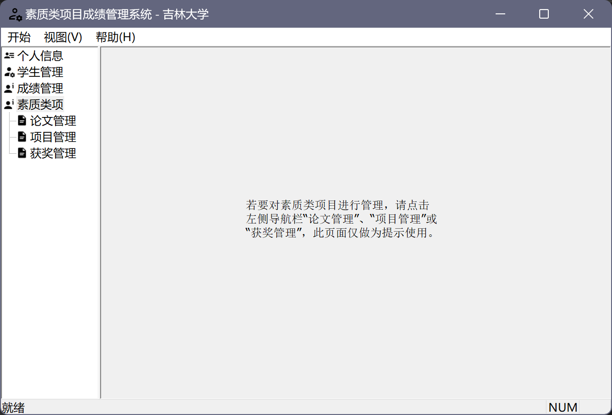
  
- 对于其他界面，暂未完工。
  
  

工作流与其他：

- ~~GUI界面使用EasyX图形库。~~（1.0版本，此方案已废弃，相关代码已重写）
- ~~GUI界面使用基于EasyX图形库的HiEasyX扩展库。~~（2.0版本，此方案已废弃，相关代码已重写）
- 使用MFC方法构建图形化界面。（第三版，目前版本号3.2.3）
- 程序设计在Visual Stodio 2022进行，最终使用setup工程生成安装包与卸载工具。
- 使用Git管理代码，仓库上传至 github.com 与 gitee.com 进行代码托管。
>（https://github.com/StarlingLin/PerformanceManagementSystem.git）  
>（https://gitee.com/StarlingLin/PerformanceManagementSystem.git）